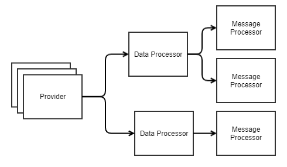

# Generic Message Processor

## Intro
An extesible generic message processing chain as a proof-of-concept testbed for prototyping and protocol development.
As a demonstration, a Generic Messaging Protocol (GMP) has been implemented.

## Overview
This framework provides a plug-and-play processing chain that allows for extension in different stages.

### Stages
#### DataProviders
The Data Provider interface is defined in [DataProvider.java](src/main/java/org/darcro/messageproc/input/DataProvider.java). Implementing this allows for the introduction of additional data sources to be input to the processing chain.
At present, the providers include:
* A UDP socket server which reads and processes byte[] payloads.
* A file reader which reads packets stored in a protobuf PacketGroup defined in [storage.proto](src/main/proto/messageproc/storage.proto)

#### DataProcessors
The Data Processor interface is defined in [DataProcessor.java](src/main/java/org/darcro/messageproc/proc/DataProcessor.java). Implementing this allows for the introduction of raw data processing in the chain.
A Data Processor can subscribe to one or more Providers.
At present, the data processors include:
* A GMP Message Parser which accepts the raw data and parses into a GMPMessage as defined in [protocol.proto](src/main/proto/messageproc/protocol.proto)

#### MessageProcessors
The Message Processor interface is defined in [MessageProcessor.java](src/main/java/org/darcro/messageproc/proc/MessageProcessor.java). Implementing this allows for the introduction of message processing in the chain.
A Message Processor can subscribe to one or more Data Processors.
At present the message processors include:
* A GMP File Processor which stores GMP Messages byte-encoded in a file
* A GMP Print Processor which prints any GMP Messages to std.out.

